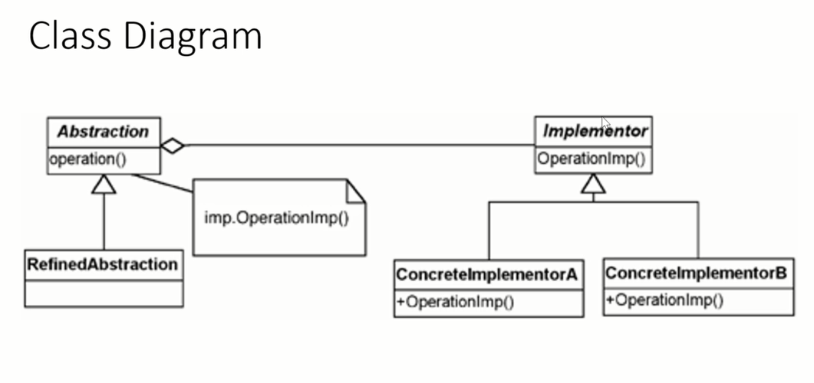
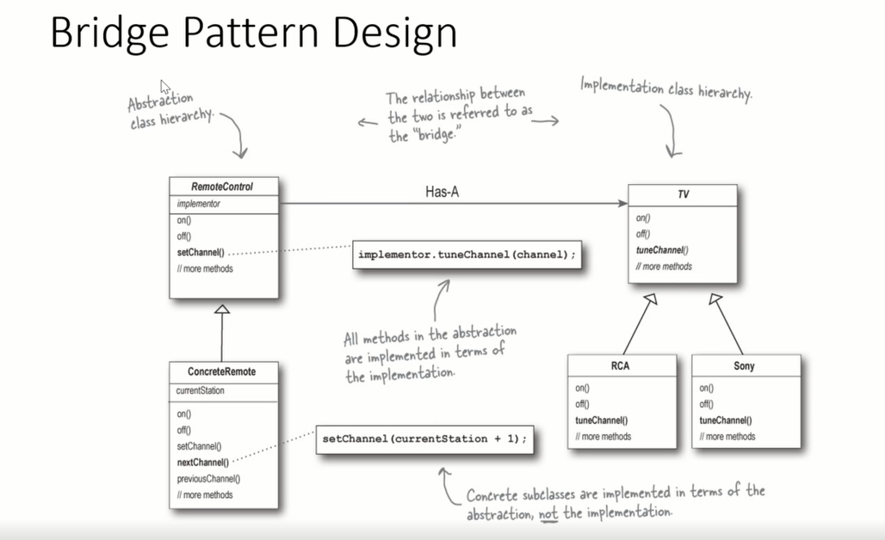
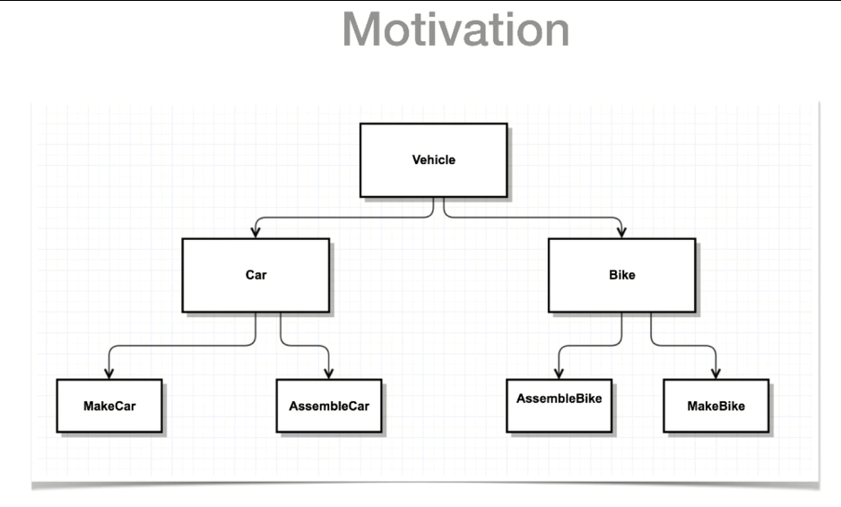
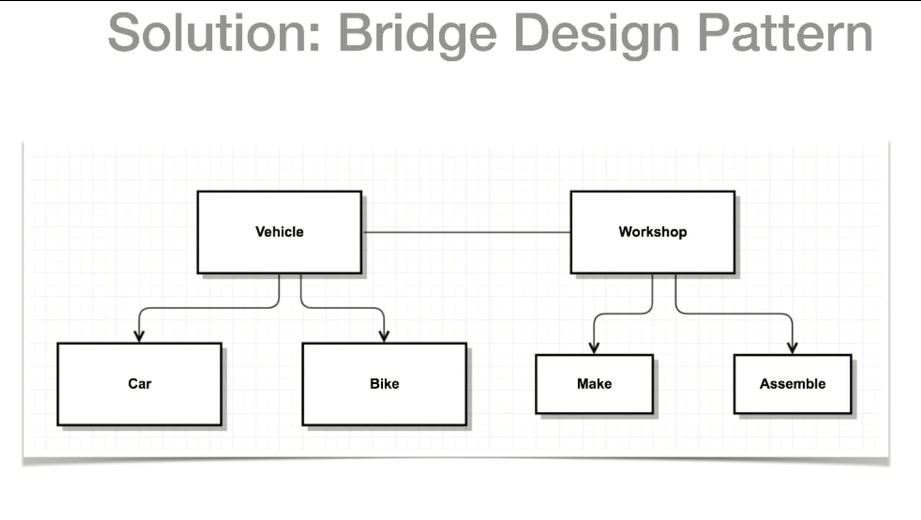

# Bridge Design Pattern

* The Bridge Pattern will decouple an abstraction from its implementation so that the two can vary independently.
* It decouples the implementation class and abstract class by providing a bridge structure between them
* **Decoupling** means to have things behave independently of each other
* **Abstraction** is how different things are related to each other conceptually (hiding details)
* **Implementation** here means the objects that the abstract class, and it's derivations used to implement themselves
  * NOT the derivations of the abstract class (concrete class)
* This pattern helps us to make concrete class functionalities independent of the interface implementer class
  * Can alter these different kind of classes structurally with affecting each other

    

### Example

* A standard software company will typically consist of the following two teams
  * Development Team
  * Technical Support Team
* A change in the operational strategy of one team should not have direct impact on the other team
* The technical support team plays the role of a bridge between the clients, and the development team that implements the product
*

### When to use the Bridge Pattern
Use when: 
* we want to avoid a permanent binding between an abstraction and its implementation
  * i.e. when the implementation must be selected or switched at run-time
* both the abstraction and their implementation should be extensible by subclassing
  * Lets you combine the different abstractions and implementations and extend them independently
* changes in the implementation of an abstraction should have no impact on clients
  * Clients code should not have to be recompiled
* you want to hide the implementation of an abstraction completely from clients
* you have a ton of implementation classes
  * A class hierarchy indicates the need for splitting an object into two parts

### Participants

* Abstraction
  * Core of the Bridge Pattern and defines the crux
    * defines the abstraction interface
  * Contains the reference to the implementer
* Refined Abstraction
  * Extends the abstraction takes the finer detail one level below
  * Hide the finer elements from implementers
* Implementer
  * Defines the interface for implementation classes
    * Does not need to correspond directly to the abstraction interface and can be very different
      * Implementer provides only primitive operations
      * Abstraction defines higher-level operations based on these primitives
    * Provide an implementation in terms of operations provided by Implementer interface
* Concrete Implementer
  * Implements the above Implementer by providing concrete implementation

