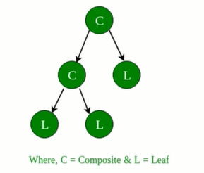
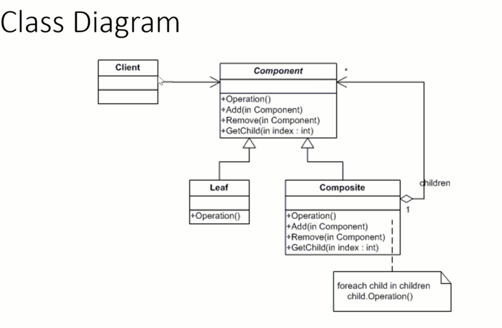

# Composite Pattern

* The composition design pattern composes objects into tree structures to represent part-whole hierarchies

  * It lets clients treat individual objects and composition of objects uniformly
* A composite is an object designed as a **composition** of one or more similar objects that all exhibit similar functionaliy

  * i.e. A group of objects that is treated the same way as a single instance of the same type of object
* We create a composite object when we have many objects with common functionalities

  * create a class that contains a group of its own objects
* This pattern allows us to build structures of objects in the form of trees
* 
* It contains the both the compositions of objects and individual objects as nodes/leaves
* We can ask each node in the tree structure to perform a task
  *Using the Composite Structure, we can apply the same operations over both composite and individual objects

  * we can ignore the differences between compositions of objects and individual objects
* Programmers often have to understand the difference between a leaf node and a branch when dealing with tree-structured data

  * makes the code more complex abd therefore more error prone
    * this pattern solves this by providing an interface that allows treating complex and primitive objects uniformly
* The **main** purpose of the Composite is to allow you to manipulate a single instance of an object the same way you would manipulate a group of them

  * The operations you can perform on all the composite objects often have a least common denominator relationship

When to use the Composite Pattern

* Use when:
  * The Client needs to ignore the difference between compositions of Objects and Individual Objects
    * Using multiple objects in the same way with nearly identical code to handle them
    * Less complex in this situation to treat primitives and composites as the same
  * you are worried about memory usages.
    * less number of objects reduces memory usage
    * keep you away from errors related to memory like java.lang.OutOfMemoryError
  * Efficiency is a concern
    * creating an Object in Java is really fast, however, we can still reduce the execution time of our program by sharing objects
  * Force to maintain child ordering

### Benifits

* Makes it easy to add new kinds of components
* Makes clients simpler
  * They do not have to know if they are dealing with a leaf or a composite component

### Drawbacks

* Makes is harder to restrict the type of components of a composite
  * You cannot rely on the type system to enforce constraint for you
    * Have to use run-time checks instead

## Implementing the Composite Pattern

#### Participants
* Component
  * Declares the interface for objects in the composition
  * Implements default behavior for the interface common to all classes
  * Declares an interface for accessing and managing its child component
* Leaf
  * Represents the leaf objects in the Composition
    * a leaf has no children
  * Defines behavior for primitive objects in the composition
* Composite
  * Defines behavior for components having children (add, remove, etc)
  * Stores child components (using some data structure eg List)
  * Implement child related operations in the Component interface
* Client
  * Manipulate objects in the composition through the Component Interface(does the grouping).
  
####Usage
* A Client uses the component class interface to interact with objects in the Composite Structure
* If a recipient is a leaf then the request is handled directly 
* If the recipient is a composite, then it usually forwards request to its child component
  * Also, may perform additional operation before and after forwarding
