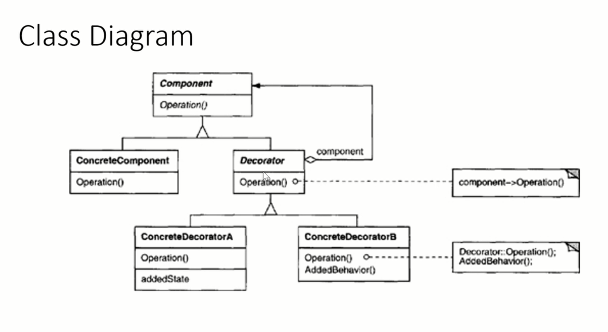

#Decorator Pattern

* This is an alternative to Sub Classing
* This pattern allows us to attach additional responsibilities to an object dynamically.
  * It allows a user to add new functionality to an existing object without altering its structure
* The main principle of the pattern says we cannot modify existing functionalities, but we can extend them
  * Open for extension but closed for modification
* The core concept applies when we want to add some specific functionalities to some specific object instead of the whole class
* The decorator is used to modify the functionality of an object at runtime
  * Other instances of the same class will not be affected by this, so individual object gets the modified behavior
* The decorator pattern will create a set of decorator classes that are used to wrap concrete components
  * providing additional functionality and keeping class method signature intact
* Decorator classes mirror the type of the components they decorate
  *Decorators change the behavior of their components by adding new functionality before and/or after methods call to component
* You can wrap a component with any amount of decorators
* 

##When to use the Decorator Pattern

* When we want toa add responsibilities to individual objects dynamically and transparently without affecting other objects
* When sub-classing is impractical
  * Sometimes many independent extensions are possible and would produce an explosion of subclasses to support every combination
  * or a class definition may be hidden or otherwise unavailable for sub-classing

## Implementation

###Participants
* **Component**
  * Defines the interface for the objects
  * Can have responsibilities added to them dynamically
* **Concrete Component**
  * Defines an object to which additional responsibilities can be attached
* **Decorator**
  * Maintains a reference to a component object
  * Defines an interface that conforms to Components interface
* **Concrete Decorator**
  * Adds responsibilities to the component
  
* The Decorator forwards requests to its Component Object
  * May optionally perform additional operations before and after forwarding the request