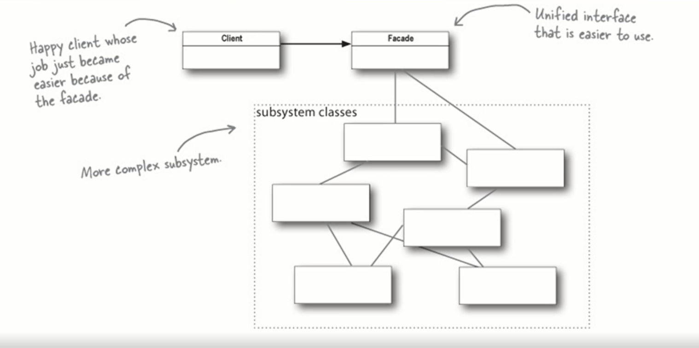
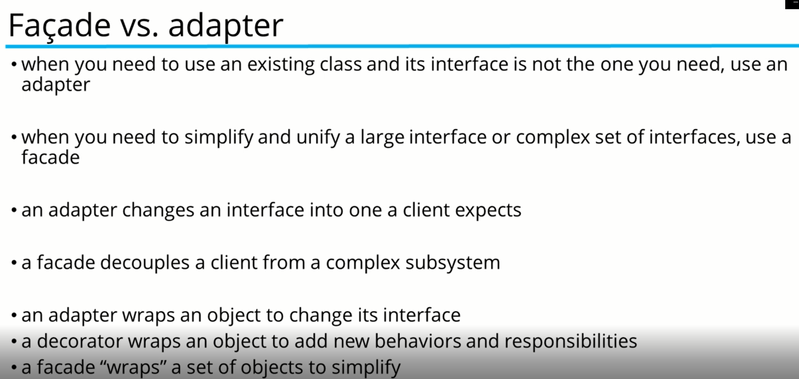

#Facade Pattern

* The Facade Pattern provides a unified interface to a set of interfaces in a system
* It defines a higher-lever interface that makes the subsystems easier to us
  * Basically hiding the complexities of the subsystem interfaces
* It doesn't add any additional functionality.
* As the name suggest it means the face of the building
  * People walking past on the road can only see this glass face of the building
  * They do not know anything about it; the wiring the pipes and other complexities are hidden
  * It hides all complexities of the building and displays a friendly face
* The Facade is more like a helper for client applications
  * Does not hide subsystem interface from the client
  * Whether to use the Facade or not is completely dependent on the Client's code
* It can be applied at any point of development, usually when the number of interfaces from and subsystems gets complex
* Subsystem interfaces are not aware of the Facade, and they should not have any reference to the Facade interface
* 

## WHen to use

* Use when:
  * You want to provide a simpel interface to a complex system
  * There are many dependencies between Client, and the Implementation classes of an Abstraction
    * Introduces a Facade to decouple the subsystem from Client and other subsystem
    * Promotes subsystem independence and portability
  * You want to layer your subsystems
    * Use a Facade to define an entry point to each subsystem level
    * 

## Implementing

* The Facade is one of the easiest patern to implement
* It involves creating a single class which provides simplified methods required by the Client.
  * Delegate calls to methods of existing system classes
  
###Participants

* **Facade**
  * Knows which subsystem classes are responsible for a request
  * Delegates Client requests to appropriate subsystem objects
* **Subsystem Classes**
  * Implement subsystem functionality
  * Handle work assigned by the Facade Object
  * Have no Knowledge of the Facade
    * They keep no references to it
* **Client**
  * Communicate to the Facade by sending requests to the Facade